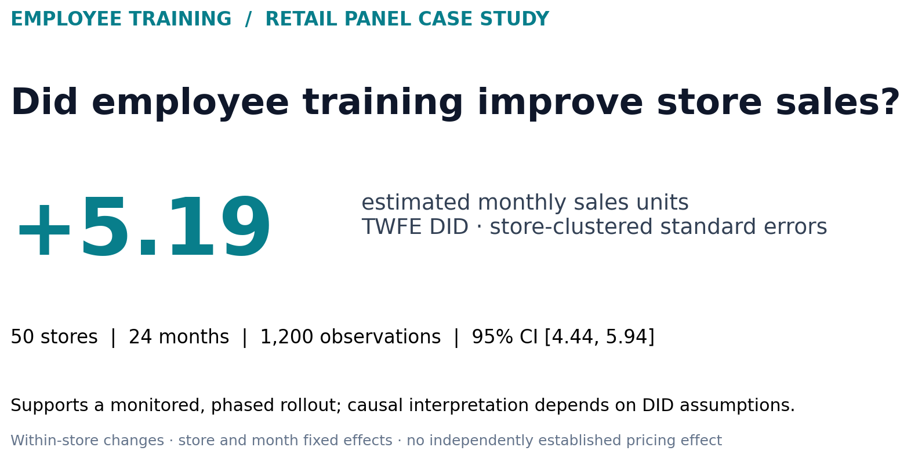
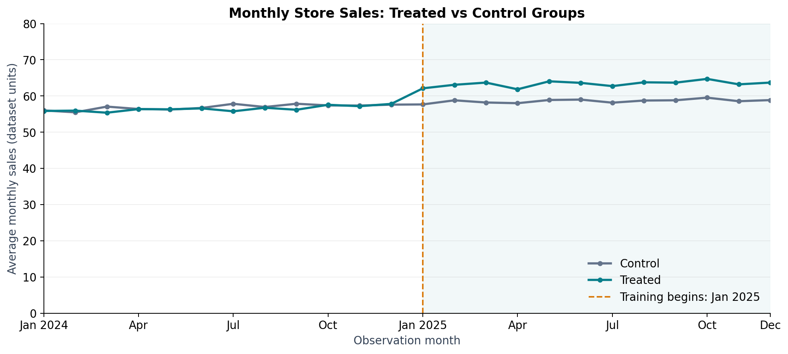
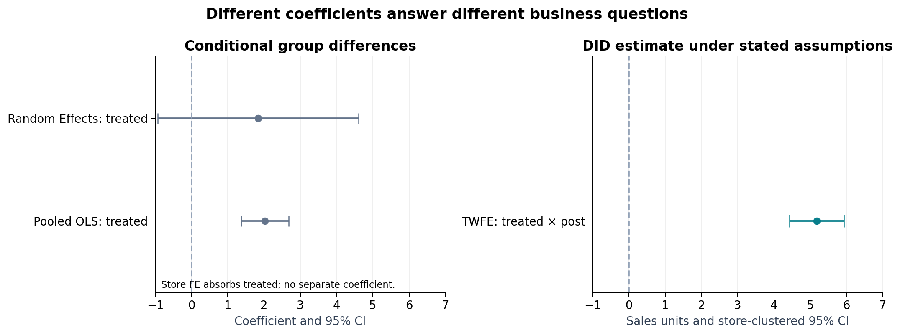

# Employee Training Causal Analysis

**Business question: Did employee training improve store sales?**

This retail case study uses **50 stores × 24 months = 1,200 observations** to evaluate a training programme introduced in January 2025. OLS, panel models, and two-way fixed effects difference-in-differences (TWFE DID) separate persistent store differences from common monthly changes.

**Key finding: approximately +5.19 monthly sales units** for trained stores relative to controls, under the DID assumptions. The TWFE model estimates **5.1852**, with store-clustered standard errors and **p < 0.001**. This supports a **phased expansion with continued performance monitoring**, subject to costs and replication in comparable stores.



## 1. Business Problem

Management needs to decide whether to expand employee training. A simple before-and-after comparison cannot distinguish training from broader sales growth, and trained stores may differ systematically from controls. The analysis therefore compares changes in both groups while accounting for stable store characteristics and common monthly shocks.

## 2. Executive Summary

- **Data:** a balanced, course-provided monthly panel spanning 2024–2025; 25 trained and 25 control stores.
- **Approach:** descriptive comparisons → OLS → store FE and RE → TWFE DID → visual parallel-trends assessment.
- **Finding:** the treatment interaction estimates a +5.19-unit effect. The model explains approximately 78.6% of observed sales variation, including fixed effects; adjusted R-squared is approximately 0.772.
- **Decision:** pilot expansion in similar stores, monitor outcomes and operational indicators, and assess economics before scaling.
- **Scope:** the main interpretation uses an identified TWFE model and explicit causal assumptions. IV/2SLS was proposed but **never empirically estimated**. See [the complete analysis report](report/employee_training_analysis_report.md).

## 3. Key Finding

Under parallel trends, no anticipation, no relevant spillovers, and no confounding group-specific shocks, the DID estimate suggests that training increased average monthly store sales by approximately **5.19 dataset units**. This is an estimated effect within the observed sample, not a realised business outcome or an ROI estimate.

Average price is fully absorbed by store and month effects in this dataset. The identified TWFE model therefore omits its redundant separate coefficient and gives the same training estimate, with a store-clustered 95% interval of **[4.44, 5.94]**. See [the complete analysis report](report/employee_training_analysis_report.md).

## 4. Data

The supplied data contain store identifiers, observation month, training-group and post-period indicators, sales, staffing, average price, and competitor count. Month 13 marks the intervention. The pipeline validates coverage and missing values and compares the CSV with the unchanged Excel workbook.

No data are invented or removed. Sales currency and measurement scale are not established, so effects are reported in dataset units. The data are course-provided; real-company provenance, simulation status, and public redistribution rights are not asserted. See [data documentation](data/README.md).

## 5. Analytical Approach

### 5.1 Descriptive Analysis

| Group   | Pre-training mean sales | Post-training mean sales |
| ------- | ----------------------: | -----------------------: |
| Control |                   56.91 |                    58.60 |
| Treated |                   56.48 |                    63.36 |

The larger increase in trained stores is descriptive evidence. A Welch test compares the 12-month post-training average for each store, using 25 independent store summaries per group: **p ≈ 0.0013**. It does not control for selection or time-varying confounding.

### 5.2 Regression Analysis

OLS uses `treated`, `post`, `staff_num`, `avg_price`, and `competitor_num`. The `treated` coefficient of **2.0243** is a conditional group difference across the full sample, not the training effect. VIF, residual Q-Q, and residual-versus-fitted plots support model inspection without claiming that graphical diagnostics prove all assumptions.

### 5.3 Panel Data Models

Store FE controls for persistent store differences. The classical pooled-versus-FE F comparison gives **F = 50.22 (p < 0.001)**, providing evidence that store-level heterogeneity matters under classical test assumptions. It is not a cluster-robust joint test.

**Store FE is retained primarily because the research design focuses on within-store changes over time.** Persistent unobserved differences across stores are substantively important, and store fixed effects control time-invariant store heterogeneity.

`treated` is constant within store and is absorbed by store effects. FE estimates `post = 2.6919` and `avg_price = 2.1002`; staffing and competitor count lose their OLS significance. Some pooled associations may reflect persistent differences between stores rather than within-store changes. The FE `post` coefficient describes an overall period change, including training exposure; it is not a control-group-only secular trend.

`RandomEffects` gives `treated = 1.8376` (p ≈ 0.194). The classical Hausman comparison has an indefinite covariance difference, so valid chi-square inference is unavailable. Store FE is selected on substantive grounds: controlling persistent store differences is appropriate for a non-random training programme. The analysis does not claim a valid Hausman rejection of RE consistency.

### 5.4 Difference-in-Differences

```text
sales_it = store_FE_i + month_FE_t + beta × (treated_i × post_t) + error_it
```

Standard errors are clustered by store to allow correlated errors across a store's monthly observations. `treated` and `post` main effects are absorbed by store and month effects respectively. Staffing and competitor count are excluded from the parsimonious specification; their earlier insignificance alone does not establish that omitted variables are harmless.

Average price varies as a store-specific level plus a common monthly change, so its variation is absorbed by the fixed effects. No separate price coefficient is estimated in TWFE. The [complete report](report/employee_training_analysis_report.md) presents the identified model and uncertainty estimates.

### 5.5 Parallel Trends



Before January 2025, group-average sales move broadly together; afterward, trained stores diverge upward. This visual check and the monthly difference table are consistent with parallel trends, but **do not prove the unobserved counterfactual assumption**. No formal event-study, placebo, or spillover regression is claimed as completed.

### 5.6 Potential IV/2SLS Extension

Management could select stores into training based on unobserved potential or motivation. Distance to the nearest training centre was proposed as an instrument: the first stage would predict training participation from distance and exogenous controls; the second stage would relate sales to instrumented training exposure using appropriate IV inference.

**The IV/2SLS model was not estimated because the required instrument data were unavailable.** No IV coefficient or first-stage F-statistic is reported. Distance relevance and exclusion remain hypotheses, especially because location may affect demand. A panel extension would instrument `treated × post` using `distance × post`, subject to a defensible exclusion restriction.

## 6. Key Results

| Result | Estimate | Interpretation |
|---|---:|---|
| OLS `treated` | 2.0243 | Conditional group difference |
| Store FE `post` | 2.6919 | Within-store period association |
| Store FE `avg_price` | 2.1002 | Within-store association; p ≈ 0.012 |
| TWFE `treated:post` | **5.1852** | Training estimate under DID assumptions |
| RE `treated` | 1.8376 | Conditional group difference; p ≈ 0.194 |



The group coefficients and DID interaction answer different questions and should not be read as interchangeable treatment estimates. FE has no separate `treated` coefficient. Estimator-specific R-squared measures are not directly comparable.

Full precision and uncertainty are available in [descriptive statistics](outputs/tables/descriptive_statistics.csv), [OLS results](outputs/tables/ols_results.csv), and [the DID results](outputs/tables/twfe_did_results.csv). The [complete report](report/employee_training_analysis_report.md) includes the OLS, FE, and RE comparison and interpretation.

## 7. Business Recommendations

1. **Expand in phases.** Test the programme in stores similar to the observed trained group and compare incremental sales against training and implementation costs before broad rollout.
2. **Monitor performance continuously.** Track sales, staffing, average price, operational changes, and concurrent promotions; retain a credible comparison group where feasible.
3. **Evaluate customer-value initiatives alongside training.** Communication, product presentation, and higher-value recommendations are plausible complementary pilots. Price associations motivate further evaluation; the TWFE price coefficient does not establish an independent causal opportunity.

## 8. Limitations

- Training was not randomly assigned; selection and unobserved time-varying differences may remain.
- Concurrent interventions, external shocks, anticipation, and spillovers can violate DID assumptions.
- Visual pre-trends are a limited diagnostic, and the observation window contains only 12 pre-treatment and 12 post-treatment months.
- Price may respond to training, and its separate TWFE coefficient is unidentified; control selection is not a guarantee against omitted-variable bias.
- Findings may not generalise beyond the 50 stores. Training costs and margins are absent, so no profitability or ROI claim is possible.
- The Hausman comparison does not support valid chi-square inference; FE is retained as a substantive design choice.

## 9. Repository Navigation

### 9.1 Project Structure

```text
employee-training-causal-analysis/
├── README.md, requirements.txt, .gitignore
├── data/                 # unchanged workbook, CSV, documentation
├── notebooks/            # executed English workflow
├── src/                  # reusable data, model, and visualisation modules
├── outputs/
│   ├── figures/          # trends, distribution, diagnostics, model comparison
│   └── tables/           # model estimates, diagnostics, data quality, provenance
├── report/               # final complete English analysis report
└── screenshots/          # key analytical outputs for presentation
```

### 9.2 File Navigation

| Location | Contents |
|---|---|
| [Analysis notebook](notebooks/employee_training_causal_analysis.ipynb) | Complete English workflow with executed results, charts, and interpretation |
| [Case study report](report/employee_training_analysis_report.md) | Business question, methodology, statistical evidence, limitations, and management recommendations |
| [Dataset](data/employee_training_data.csv) | The complete panel of 50 stores and 1,200 monthly observations |
| [Data documentation](data/README.md) | Variable definitions, observation period, source information, and preprocessing |
| [Source code](src/) | Reusable functions for data preparation, hypothesis testing, regression, panel models, DID, and visualisation |
| [Result tables](outputs/tables/) | Descriptive statistics, model estimates, confidence intervals, and model diagnostics |
| [Figures](outputs/figures/) | Monthly sales trends, sales distributions, regression diagnostics, and model comparison |
| [Presentation images](screenshots/) | Key finding, monthly trends, and model results for a quick project overview |
| [Data quality checks](outputs/tables/data_quality.csv) | Panel coverage, missing values, unique store-month keys, and treatment consistency |
| [Dependencies](requirements.txt) | Package versions for reproducing the analysis |

## 10. How to Run

Requires **Python 3.12**. Download or clone this repository and open a terminal in its root directory:

```bash
python -m venv .venv
```

Activate on Windows PowerShell with `.\.venv\Scripts\Activate.ps1`, or on macOS/Linux with `source .venv/bin/activate`. Then:

```bash
python -m pip install -r requirements.txt
python -m src.run_analysis
python -m jupyterlab
```

Open `notebooks/employee_training_causal_analysis.ipynb`, select the virtual environment's Python kernel, and run all cells in order. The notebook also calls the full pipeline, so it can run independently of the command-line analysis step. Outputs are overwritten reproducibly; the source data are not overwritten.

For a headless notebook execution that uses the current interpreter:

```bash
python -m src.execute_notebook
```

The pipeline validates the panel structure, source-data consistency, and TWFE design rank. The modular pipeline and all 14 code cells of the English notebook have executed successfully in a clean environment installed from `requirements.txt`. The [complete report](report/employee_training_analysis_report.md) documents the final findings and methodological qualifications.

## 11. Technologies and Analytical Skills

**Python · Panel Data · Fixed Effects · Difference-in-Differences · Business Analytics**

| Capability | Tools and methods | Application in this project |
|---|---|---|
| **Data preparation and validation** | pandas, NumPy, openpyxl | Load Excel and CSV data, verify source consistency, validate the balanced panel, and aggregate store-level outcomes |
| **Statistical analysis** | SciPy, statsmodels | Conduct the Welch t-test, estimate OLS, calculate VIF, and inspect residual diagnostics |
| **Panel modelling** | linearmodels | Estimate pooled OLS, store fixed effects, and random effects; assess store heterogeneity and qualify model-comparison inference |
| **Causal inference** | statsmodels, TWFE DID | Evaluate relative sales changes using store and month effects, store-clustered standard errors, confidence intervals, and a visual pre-trend assessment |
| **Data visualisation** | Matplotlib | Communicate sales patterns, model uncertainty, and the distinction between group differences and treatment estimates |
| **Reproducible analysis** | Jupyter, pathlib, modular Python | Execute the complete notebook, use portable paths, and regenerate figures and tables with pinned dependencies |
| **Business communication** | Case study reporting | Translate statistical evidence into a phased rollout recommendation while distinguishing assumptions, limitations, and business implications |

Dependencies are pinned in [requirements.txt](requirements.txt). Notebook automation uses nbformat, nbclient, and ipykernel to execute the workflow without an interactive session.
