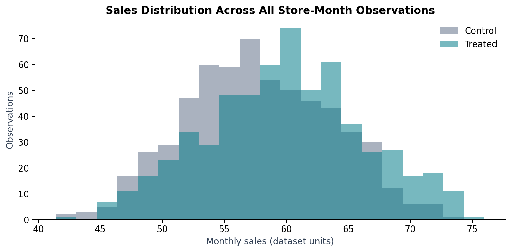
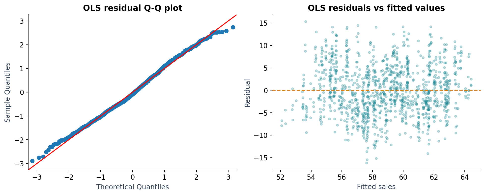

# Employee Training Causal Analysis

## 1. Business case and executive summary

**Author: Cai Yumeng**

This individual academic project uses a course-provided panel and a simulated retail management brief. The report is written for an operations manager considering a further training pilot.

Employee training represents an investment in store capability. The business question is whether trained stores improved sales beyond the changes experienced by stores that did not receive training. This report evaluates a January 2025 training intervention using a balanced monthly panel of 50 stores observed during 2024–2025.

The two-way fixed effects difference-in-differences estimate is **5.1852 additional monthly sales units**, with store-clustered standard errors and p < 0.001. Its 95% normal-reference confidence interval is approximately **4.44 to 5.94 units**. The estimate supports a monitored, phased expansion to comparable stores, conditional on parallel trends and the other identification assumptions described below. Training costs and margins are unavailable, so the result does not establish profitability or return on investment.

The analysis progresses from descriptive comparisons and a store-level Welch test to OLS, store fixed effects, random effects, and difference-in-differences. Monthly group trends provide a descriptive assessment of the parallel-trends assumption. IV/2SLS is a proposed extension only and has not been estimated.

The completed analytical contribution is a validated panel, a comparison of pooled and within-store associations, an estimated training effect with uncertainty, and reproducible figures and tables. The proposed business contribution is a decision framework for further testing and scaling; implementation, realised profit, and rollout outcomes have not been measured.

The report connects an operational question to an analytical specification, reproducible evidence, and a next decision. It defines the outcome and comparison unit before estimation, explains which assumptions support causal interpretation, and separates the measured sales effect from the additional information needed to assess business value.

## 2. Data and preparation

The course-provided dataset contains **1,200 observations: 50 stores × 24 months**. There are 25 training-group stores and 25 control stores. Each store has 12 pre-intervention and 12 post-intervention observations. Calendar labels follow the supplied observation-period metadata: observation month 1 corresponds to January 2024 and month 13 to January 2025.

| Variable | Definition |
|---|---|
| `store_id` | Store identifier |
| `month` | Observation month from 1 to 24 |
| `treated` | Training-group indicator that remains constant within store |
| `post` | Indicator for observation months 13–24 |
| `sales` | Monthly sales in the dataset's measurement units |
| `staff_num` | Staff count |
| `avg_price` | Average price indicator |
| `competitor_num` | Competitor count |

Data checks confirm complete store-month coverage, unique store-month keys, no missing values in analysis variables, and treatment status that remains constant within each store. The post indicator matches the intervention period. The CSV is checked against the supplied workbook; no observations are filtered, imputed, rounded, or otherwise modified for estimation. The panel is sorted by store and month for panel models.

The materials do not establish an independently verified real-company origin or a currency scale for sales. Results are therefore expressed in dataset units. Training-centre distance, store coordinates, training costs, and records of concurrent interventions are unavailable. Further data documentation is provided in [the data directory](../data/README.md).

### 2.1 Consistent analytical definitions

The primary key is `(store_id, month)`, and the expected coverage is every store in each of the 24 months. Treatment status must be binary and constant within store, while the post indicator must match months 13–24. Data validation checks these conditions and verifies the CSV against the workbook before modelling.

The main outcome is monthly store sales. Group trends average stores within each month; descriptive tables summarise store-month records within group and period. The Welch test instead uses each store's post-period mean as one observation. DID reports a relative monthly sales change for treated stores, with uncertainty clustered at the store level. Keeping these units distinct prevents repeated monthly observations from being treated as independent stores.

## 3. Descriptive evidence

### 3.1 Group and period comparisons

| Group and period | Observations | Mean sales | Median | Standard deviation |
|---|---:|---:|---:|---:|
| Control before training | 300 | 56.91 | 56.36 | 5.76 |
| Control after training | 300 | 58.60 | 58.15 | 5.89 |
| Treated before training | 300 | 56.48 | 56.56 | 5.42 |
| Treated after training | 300 | 63.36 | 63.26 | 5.35 |

Using unrounded group means, control sales increased by **1.6939 units**, while treated sales increased by **6.8791 units**. The unadjusted difference in changes is **5.1852 units**. Pre-training average sales were similar, with trained stores approximately 0.43 units below controls. These comparisons describe the observed data; they do not alone identify a causal training effect.



### 3.2 Store level hypothesis test

The Welch independent-samples test uses each store's average sales across its 12 post-training observations. This gives 25 store-level averages per group rather than treating 600 monthly records as independent observations.

The two-sided test produces **t = −3.4246** when ordered as control minus treated, and **p = 0.0012917**. Post-training average sales differ significantly between groups. The test does not adjust for selection into training, common time changes, or other sources of confounding and is not definitive causal evidence.

## 4. Regression analysis and diagnostics

The pooled OLS model relates sales to training-group membership, the post period, staffing, average price, and competitor count:

```text
sales_it = intercept + b1 treated_i + b2 post_t + b3 staff_num_it
           + b4 avg_price_it + b5 competitor_num_it + error_it
```

| Variable | Coefficient | Standard error | p value |
|---|---:|---:|---:|
| Intercept | 46.8994 | 1.5279 | < 0.001 |
| Treated | 2.0243 | 0.3332 | < 0.001 |
| Post | 3.2385 | 0.3503 | < 0.001 |
| Staff count | 0.6127 | 0.0872 | < 0.001 |
| Average price | 0.2071 | 0.0696 | 0.0030 |
| Competitor count | 0.6806 | 0.1724 | < 0.001 |

R-squared is **0.1915** and adjusted R-squared is **0.1881**. The conventional model F-statistic is approximately **56.56**, with p < 0.001. OLS uses conventional standard errors here as an exploratory comparison; the primary DID analysis uses store-clustered uncertainty.

The `treated` coefficient is a conditional group difference across the full observation period. It is not a difference-in-differences effect and should not be interpreted as the causal effect of training. Persistent differences in store scale, location, management, or customer base can contribute to pooled associations.

| Variable | Variance inflation factor |
|---|---:|
| Treated | 1.056 |
| Post | 1.168 |
| Staff count | 1.246 |
| Average price | 1.074 |
| Competitor count | 1.189 |

These values indicate limited multicollinearity among the regressors in this OLS specification. Residual Q-Q and residual-versus-fitted plots provide graphical checks of distribution and model shape. Visual diagnostics do not establish independence of monthly errors or prove that all regression assumptions hold.



## 5. Panel models and model selection

### 5.1 Store fixed effects

Store fixed effects remove stable store characteristics and estimate associations from variation within stores. Because `treated` does not change within a store, it is absorbed by store effects and has no independently estimable coefficient in this model.

| Variable | Store FE coefficient | Store clustered standard error | p value |
|---|---:|---:|---:|
| Post | 2.6919 | 0.5161 | < 0.001 |
| Staff count | 0.1533 | 0.3139 | 0.6254 |
| Average price | 2.1002 | 0.8373 | 0.0123 |
| Competitor count | 0.5629 | 0.6058 | 0.3530 |

Within R-squared is **0.3229**. The conventional model F-statistic is approximately **136.66**. The classical F comparison of pooled OLS and store FE gives **F = 50.2161**, with 48 numerator and 1,146 denominator degrees of freedom and p < 0.001. This comparison provides evidence that store-level heterogeneity matters under classical F-test assumptions; it is not a cluster-robust joint test.

Staffing and competitor count lose their OLS significance after store effects are included. This is consistent with some pooled relationships reflecting persistent differences between stores rather than within-store changes. Average price and the post period remain positive associations. The post coefficient combines changes across all stores, including training exposure; it is not a control-group-only estimate of natural sales growth.

### 5.2 Random effects comparison

The random effects model includes an intercept and accounts for store-level random heterogeneity under the assumption that store effects are uncorrelated with the regressors.

| Variable | Random effects coefficient | Standard error | p value |
|---|---:|---:|---:|
| Intercept | 42.7179 | 5.4177 | < 0.001 |
| Treated | 1.8376 | 1.4143 | 0.1941 |
| Post | 3.0907 | 0.3099 | < 0.001 |
| Staff count | 0.6338 | 0.1906 | 0.0009 |
| Average price | 0.4071 | 0.2762 | 0.1407 |
| Competitor count | 0.6886 | 0.3242 | 0.0339 |

A classical Hausman comparison of common FE and RE slopes produces an indefinite covariance-difference matrix. Valid chi-square inference is therefore unavailable: the analysis does not claim that a Hausman test rejects RE consistency. Fixed effects are retained primarily because the analysis focuses on within-store changes over time. Persistent unobserved differences across stores are substantively important, and store fixed effects control for time-invariant store heterogeneity. R-squared definitions differ across panel estimators and should not be compared as a single model-ranking criterion.

## 6. Difference in differences evaluation

### 6.1 Identified model specification

The main interpretation uses an identified two-way fixed effects model:

```text
sales_it = store_FE_i + month_FE_t
           + beta (treated_i × post_t) + error_it
```

Store effects control persistent differences between stores. Month effects control shocks shared by all stores in a given month. The interaction estimates the incremental change for trained stores relative to controls. The separate `treated` and `post` terms are absorbed by the corresponding fixed effects.

Average price varies as a store-specific level plus a common monthly change in this dataset. It therefore lies within the span of store and month effects and cannot have a separate coefficient in TWFE. Its variation is already absorbed by those effects. The model therefore does not estimate a separate price coefficient. This does not establish that unobserved store-specific, time-varying factors are controlled.

Staff count and competitor count are not included in the parsimonious TWFE specification. Their earlier FE insignificance informed that choice, but statistical insignificance alone is not a sufficient test of whether a variable could confound the training estimate.

### 6.2 Training estimate and uncertainty

| Result | Value |
|---|---:|
| Training interaction coefficient | **5.185167** |
| Store clustered standard error | 0.382603 |
| p value | < 0.001 |
| 95 percent normal reference confidence interval | [4.435279, 5.935054] |
| Store effects | Included |
| Month effects | Included |
| Observations | 1,200 |
| Store clusters | 50 |

Standard errors are clustered by store to allow correlated errors across a store's monthly observations. The confidence interval uses a normal reference distribution. Store clustering does not address every possible pattern of cross-store error dependence.

TWFE R-squared is **0.7862** and adjusted R-squared is **0.7723**. These fit statistics include the contribution of fixed effects rather than measuring training's contribution alone.

A joint month-effects test in the identified model gives **F = 4.8574**, with 23 numerator and 49 clustered denominator degrees of freedom, and p ≈ **0.00000172**. Common monthly changes matter, although this test does not validate the causal assumptions.


OLS and RE treatment-group coefficients describe conditional group differences. The DID interaction describes relative changes. These quantities answer different questions and should not be treated as interchangeable estimates of the training effect.

The estimated 5.19 units describe an average monthly effect for the trained group under the maintained assumptions. They do not represent a percentage uplift or a guarantee for each individual store. The confidence interval describes sampling uncertainty under the model; it cannot quantify bias caused by a violation of parallel trends or another causal assumption.

## 7. Parallel trends and causal assumptions


Before January 2025, monthly sales in the two groups move broadly together, and differences fluctuate within a relatively small range. After training begins, the treated group rises above the control group. This visual evidence is consistent with parallel trends but cannot prove how trained stores would have performed without training. Monthly group differences are descriptive statistics, not an estimated event-study regression.

A causal interpretation of the training interaction requires that, without training, both groups would have experienced comparable changes. It also requires no relevant anticipation, no spillovers that change control-store outcomes, and no simultaneous group-specific intervention driving the observed divergence. The specification does not eliminate bias from unobserved store-specific changes that coincide with training.

No formal event study, placebo regression, geographic spillover analysis, or alternative assignment design is presented as completed.

## 8. Management implications

### 8.1 Evidence and decision priorities

**Expand through a controlled pilot.** The estimated positive training effect supports testing the programme in comparable stores. Use the pilot to assess commercial significance, delivery quality, and uncertainty before committing to a broader rollout.

**Monitor outcomes and implementation.** Differences between pooled and within-store coefficients show why consistent store-level observation matters. Record monthly sales, staffing, average price, promotions, training assignment, and attendance. Changes in staffing or price should be interpreted as operating context rather than independently established causal drivers.

**Evaluate complementary customer-value initiatives explicitly.** Communication skills, product presentation, and higher-value recommendations are plausible proposals. Test them separately from training, or specify a combined programme, so that interpretation reflects what was actually implemented. Price associations alone do not establish a pricing opportunity.

### 8.2 Proposed pilot design

Where feasible, randomise eligible stores to immediate training or a later rollout. Define eligibility using business feasibility and baseline store characteristics, such as sales and staffing, before allocation. Keep the store as the assignment and analysis unit, and retain all assigned stores in their allocation groups regardless of training attendance. Attendance informs implementation quality and should not determine inclusion in the effect estimate.

Pre-specify the baseline and follow-up windows, the monthly outcome definition, the treatment start, and decision criteria. Account for seasonal coverage when choosing the observation window, record other interventions, and retain comparison stores throughout follow-up. The proposed primary outcome is average monthly store sales, evaluated across all allocated stores with uncertainty estimates appropriate to the design.

If randomisation is impractical, document the assignment rule, keep a credible comparison group, and assess differential trends and concurrent interventions before interpreting changes causally. This is a proposed future design; the observed programme was not randomised, and no new experiment has been executed.

### 8.3 Proposed monitoring measures

| Measure | Definition and observation unit | Purpose and required fields |
|---|---|---|
| Incremental monthly sales | Difference in average sales changes between assigned pilot and comparison stores across pre-specified baseline and follow-up windows | Primary outcome; future store-month sales, allocation group, and intervention dates |
| Training completion rate | Staff completing the programme divided by staff assigned to it, calculated for each store and training cohort | Delivery quality; staff assignment, attendance, and completion records |
| Incremental contribution after programme costs | Estimated incremental revenue multiplied by the applicable contribution margin, less incremental direct and indirect programme costs over the same evaluation window | Economic decision; documented sales-unit conversion, revenue, margin, training, travel, and staff-time costs |
| Staffing disruption | Overtime hours associated with training per store and month, considered alongside recorded staffing levels | Operational guardrail; staff schedules, hours, and attendance dates |
| Customer complaint rate | Recorded complaints divided by recorded transactions per store and month | Service guardrail; complaint counts and transaction counts using consistent definitions |

All measures in this scorecard are proposed. Only sales, staff count, average price, competitor count, and the panel identifiers are present in the current dataset. Completion, cost, overtime, and customer-service outcomes have not been measured. Sales must be given a verified measurement scale before calculating incremental revenue or contribution.

### 8.4 Scaling decision

Define what counts as commercially meaningful benefit and acceptable operational disruption before reviewing pilot outcomes. Expansion should consider the estimated effect, its confidence interval, the credibility of the comparison, delivery quality, and contribution after programme costs. Statistical significance by itself is insufficient.

If results are too imprecise, extend observation or reconsider the evaluation design. If delivery is inconsistent, investigate implementation before assuming the programme cannot work. If costs or operational guardrails are unfavourable, reassess the rollout scope. The current analysis provides evidence for further testing and no numerical ROI, profitability target, or guaranteed store-level gain.

## 9. Limitations and proposed IV extension

Training participation was not randomly assigned. Management preferences, store potential, or employee motivation may affect both participation and later sales. Fixed effects address stable differences; DID addresses common changes, but selection connected to different future trends can still bias the estimate.

Concurrent promotions, regional shocks, anticipation, and spillovers are potential threats. The observation window contains only 12 months before and 12 months after intervention, limiting assessment of longer-term effects. Findings may not generalise beyond the 50 stores. Costs, margins, geographical data, and other intervention records are absent.

Data collection priorities are allocation and attendance records, concurrent intervention logs, a verified sales-unit definition, and training costs and margins. Those fields would support implementation monitoring and an economic evaluation. Formal event-study and placebo analyses could strengthen future assessment of timing and trends, but would still not prove every causal assumption.

An **IV/2SLS strategy was proposed but not estimated**, because distance from each store to the nearest training centre is unavailable. Conceptually, distance could influence participation through travel and scheduling costs. Relevance, exclusion, and exogeneity remain untested; geography could also influence demand directly.

A proposed panel extension would instrument `treated × post` with `distance × post`, because store effects absorb constant distance and treatment status. A first stage would model exposure using the instrument and exogenous controls, and an IV second stage would estimate the sales relationship with appropriate two-stage inference. Neither a first-stage F-statistic nor an IV treatment coefficient is reported.

## 10. Reproducibility and conclusion

The modular pipeline loads and verifies the original data, estimates the models, validates the panel structure, source-data consistency, and TWFE design rank, and generates figures and tables. The executed English notebook follows the complete workflow.

The local reporting workflow regenerates tables, figures, and presentation images from the same computed results. A reproducibility manifest records package versions and data-file hashes so reviewers can check the environment and inputs. Modular functions separate data checks, descriptive analysis, estimation, and visualisation, making the calculation path inspectable without a complex software architecture.

From the repository root, install the dependencies in a Python 3.12 virtual environment and run:

```bash
python -m pip install -r requirements.txt
python -m src.run_analysis
python -m src.execute_notebook
```

See [the project README](../README.md) for environment activation and interactive notebook instructions. Relevant computed outputs include [descriptive statistics](../outputs/tables/descriptive_statistics.csv), [OLS results](../outputs/tables/ols_results.csv), [the DID estimate](../outputs/tables/twfe_did_results.csv), and [monthly group trends](../outputs/tables/monthly_trends.csv).

The observed evidence supports an estimated training effect of approximately **5.19 monthly sales units**, conditional on DID assumptions. The appropriate business response is a phased, monitored expansion with an explicit economic evaluation and stronger data collection for future causal analysis.

The completed project demonstrates Python data preparation, statistical testing, econometric model interpretation, reproducible reporting, and communication of actionable decisions. These capabilities are evidenced by the analysis files; the proposed future experiment and business monitoring measures are not presented as completed implementations.
